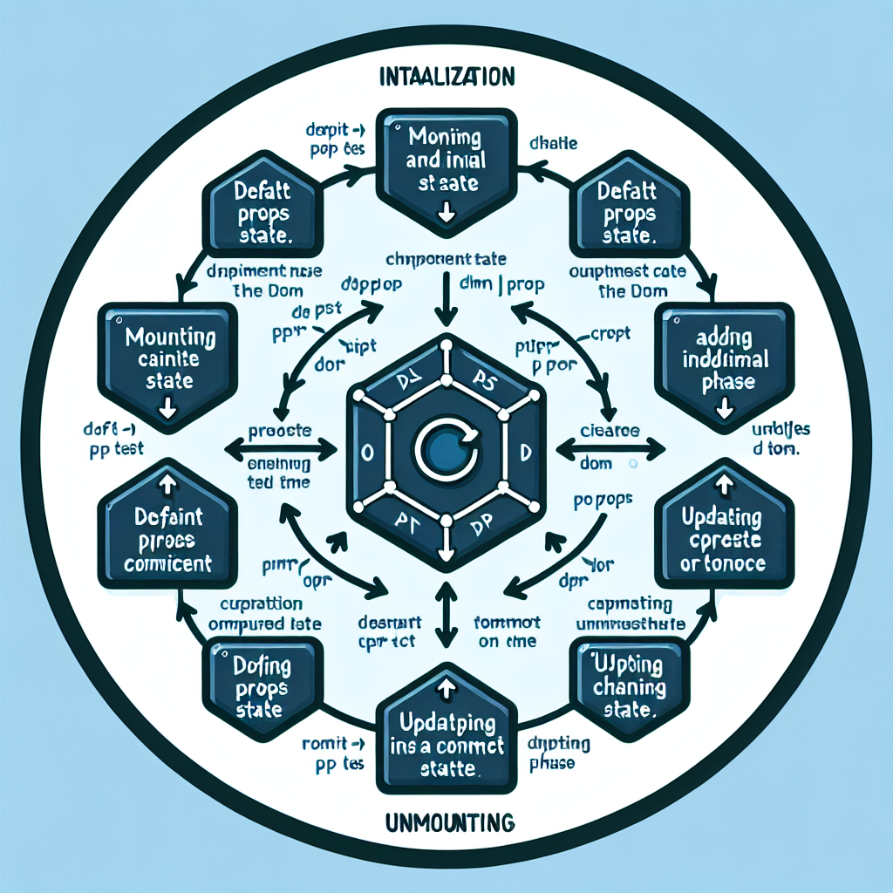

<h2>Interview Questions Of React</h2>

<ol>
<li>
What are the features of React?

The features of React are as follows:

<ul>
<li>

JSX

JSX serves as a syntax extension to JavaScript, facilitating the combination of HTML structures with JavaScript code within React files.
</li>
<li>

Components

JSX serves as a syntax extension to JavaScript, facilitating the combination of HTML structures with JavaScript code within React files.
</li>

<li>

Virtual DOM

React employs a Virtual DOM, which is a lightweight representation of the actual DOM stored in memory. This 
approach allows React to selectively update only the relevant parts of the real DOM when the state of an object changes files.
</li>
<li>

Data Binding

React adopts a one-way data-binding approach, ensuring a modular and efficient structure. Unidirectional data flow signifies that in a React app, child components are often nested within parent components.
</li>

<li>

High Performance

React's high performance is driven by its ability to update only the components that undergo changes, rather than refreshing the entire set. This results in significantly faster web applications.
</li>

</ul>
</li>
<li>
What is difference between element and component in React?
<ul>
<li>
Element
An Element is a simple object that describes what you want to show on the screen. It defines the structure of DOM nodes or other components. Elements can include other Elements in their properties. Once created, Elements cannot be changed. Creating a React Element is a straightforward and inexpensive operation.
<ul>
<li>

Example of creating an Element using JSX:

JSX serves as a syntax extension to JavaScript, facilitating the combination of HTML structures with JavaScript code within React files.
<pre>
<code>
const element = 
Login
;
</code>
</pre>
</li>
<li>
When expressed without JSX, it would look like:
<pre>
<code>
const element = React.createElement("div", { id: 
"login-btn" }, "Login");
</code>
</pre>
</li>
<li>
This element is essentially an object:
<pre>
<code>
{

 type: 'div',

 props: {

 children: 'Login',

 id: 'login-btn'

 }

}
</code>
</pre>
</li>
<li>
This object is then rendered to the DOM using ReactDOM.render().
<pre>
<code>
const element = React.createElement("div", { id: 
"login-btn" }, "Login");
</code>
</pre>
</li>
</ul>
</li>

<li>
Component
A Component can be declared in various ways. It can be a class with a render() method, or it can be defined as a function. Components take props as input and return a JSX tree as output. Components are more powerful and flexible compared to Elements.
<ul>
<li>
Example of creating a functional Component using JSX
<pre>
<code>
const Button = ({ handleLogin }) => (

 

 Login

 

);
</code>
</pre>
</li>
<li>
When transpiled, it becomes:
<pre>
<code>
const Button = ({ handleLogin }) =>

 React.createElement(

 "div",

 { id: "login-btn", onClick: handleLogin },

 "Login"

 );
</code>
</pre>

In this example, is a functional component that takes as a prop and returns a JSX tree. Components are a more dynamic way to create reusable pieces of UI.

</li>
</ul>
</li>
</ul>
</li>

<li>
How to create components in React?
<ol>
<li>
Function Components

Function components are the simplest way to create a component in React. They are pure JavaScript functions that take a props object as the first parameter and return React elements to display the output.

<ul>
<li>
Example of a function component
<pre>
<code>
function Welcome({ personName }) {

 return <h1>{`Welcome, ${personName}!`}</h1>;

}
</code>
</pre>

In this function component, takes a prop and displays a personalized welcome message.

</li>
</ul>
</li>
<li>
Class Components

Alternatively, you can use ES6 classes to define a component. The equivalent class component for the above function component would look like this:

<pre>
<code>
class Greeting extends React.Component {

 render() {

 return <h1>{`Greetings, 
${this.props.userName}!`}</h1>;

 }

}
</code>
</pre>
<article>

In this class component, extends and uses a method to display a greeting. The prop is accessed 
using. Greeting React.Component render this.props.userName

Both function and class components accomplish the same goal of creating reusable and modular pieces of UI. The choice between them depends on the complexity of the component and whether state or lifecycle methods are needed.

</li>
</ol>
</li>
<li>
What is the Virtual DOM?
<ul>
<li>

The Virtual DOM is like a blueprint or a copy of the real DOM that is stored in the computer's memory. It's a concept used by React to make updating and changing things on a webpage more efficient.

<ul>
<li>
Why is it Needed?

When we make changes to a webpage, like updating a list, traditional methods often involve updating the entire webpage, even if only a small part has changed. This can be slow and inefficient.

</li>
<li>
How Does it Work?

<ol>
<li>
Virtual DOM Objects

For every object on the webpage, there is a corresponding virtual object in the memory. These virtual objects have the same properties as the real objects.

</li>
<li>
Blueprint of the DOM

Think of the virtual DOM as a blueprint of the real DOM. Changes made to the virtual DOM don't immediately show up on the screen. they are like plans for what should change.

</li>
<li>
Faster Updates

Updating the virtual DOM is much faster than updating the real DOM. It's like working on a draft before finalising a document.

</li>
<li>
Two Virtual DOMs

React uses two sets of virtual DOMs – one to store the current state and another to store the previous state of objects.

</li>
<li>
Efficient Updating

When something changes, React compares the two virtual DOMs to see what's different. It then updates only the parts that have changed in the real DOM, rather than updating the entire webpage.In simpler terms, the Virtual DOM is like a behind-the-scenes helper that makes updating web pages faster and more efficient by smartly figuring out what needs to change and updating only those parts.

</li>
</ol>
</li>
</ul>
</li>
</ul>
</li>
<li>
What are keys in React and why do we need them?
<ul>
<li>

The "key" is a special attribute used when working with arrays of elements in React. It helps React keep track of changes, additions, and removals in the array.
When you're rendering a list of items, React needs a way to identify each item uniquely. The "key" prop serves this purpose, allowing React to efficiently update the user interface.

Example

<ul>
<li>
Suppose you have a list of books:
<pre>
<code>
const books = [

 { id: 1, title: "React Magic" },

 { id: 2, title: "JavaScript Wonders" },

 { id: 3, title: "Web Development Odyssey" },

];
</code>
</pre>
</li>
<li>
You can use the "key" prop when mapping over this array to render each book:
<pre>
<code>
const bookItems = books.map((book) => <li 
key={book.id}>{book.title}</li>);
</code>
</pre>

Here, we're using the unique of each book as the key id .

<ul>
<li>
It's crucial to use unique keys among siblings to avoid issues.
</li>
<li>
If your data doesn't have stable IDs, using the item index as a key is a last resort. However, this is not recommended if the order of 
items may change, as it can impact performance.
</li>
<li>
If you extract list items into separate components, apply keys to the component instead of the li tag.
</li>
<li>
The "key" attribute accepts either a string or a number, and it's converted internally to a string type.
</li>
<li>
A warning message will appear in the console if the "key" prop is not present on list items.
</li>

</ul>
</li>
</ul>
</li>
</ul>
</li>

<li>
Explain the steps to create a react application and print hello world?
<ul>
<li>

Steps to Create a React Application

<ul>
<li>
Install Node

Before installing React, ensure that Node is installed on your computer. You can download it from.

</li>
<li>
Create React App

Open the terminal and run the following command to create a new React application (replace with your preferred application name):

<pre>
<code>
npx create-react-app my-react-app
</code>
</pre>
</li>
<li>
Navigate to the Application Folder

Move to the newly created application folder:

<pre>
<code>
cd my-react-app
</code>
</pre>
</li>
<li>
Print "Hello World!" Example

Now, open the file and replace its content with the following:

 
<pre>
<code>
import React from 'react';

function App() {

 return (

 

 <h1>Hello World!</h1>

 

 );

}

export default App;
</code>
</pre>

</li>
<li>
Run the Application

In the terminal, run the following command to start the development server:

<pre>
<code>
npm start
</code>
</pre>

This will open your new React application in a web browser, and you should see "Hello World!" displayed on the webpage.

In this example, the component is a simple React function component that returns JSX to render the "Hello World!" message. The command is used to run the application and launch a development server.

</li>
</ul>
</li>
</ul>
</li>

<li>
How are comments written in React?

Comments in React/JSX are similar to JavaScript multiline comments but are enclosed in curly braces.

<ul>
<li>
Single-line comments
<pre>
<code>

 {/* Single-line comments(In vanilla JavaScript, the single-line comments are represented by double slash(//)) */}

 {`Welcome, ${userName}! Let's dive into React`}

</code>
</pre>
</li>
<li>
Multi-line comments
<pre>
<code>

 {/* 

 This is a multiline comment in React.
It provides additional information about the code.

 */}

 {`Welcome, ${userName}! Let's dive into React`}

</code>
</pre>

In these modified examples, the comments now convey a welcoming message to the user, demonstrating how comments can be used to explain and document code within the JSX structure.

</li>
</ul>
</li>

<li>
Explain how lists are created in React?
<ul>
<li>
Lists are essential for displaying dynamic content on a website. In React, you can create a list using the method of an array. Here's an example:
 
<pre>
<code>
import React from 'react';

import ReactDOM from 'react-dom';

const fruits = ['Apple', 'Banana', 'Orange', 
'Grapes', 'Watermelon'];

const fruitList = fruits.map((fruit, index) => {

 return <li key={index}>{fruit}</li>;

});

 

ReactDOM.render(

 <ul>

 {fruitList}

 </ul>,

 document.getElementById('root')

);
</code>
</pre>

In this modified example, we have a list of fruits, and the method is used to create a list of JSX elements ( elements) dynamically. 
Each fruit is represented as a list item, and the resulting list is rendered inside an unordered list ( ) in the specified HTML element with the ID 'root'. The attribute is added to each element for better performance and React's internal tracking of list items.

</li>
</ul>
</li>

<li>
Explain the difference between functional components and class components.
<ul>
<li>
Functional Components
<ol>
<li>

Definition

A functional component is a plain JavaScript pure function that accepts as an argument.

</li>
<li>

Rendering

Does not use the method. Instead, the component's return value represents the UI.

</li>
<li>
State

Cannot use state. It is also known as a stateless component.

</li>
<li>

Lifecycle Methods

Cannot use React lifecycle methods (e.g., ).

</li>
<li>

Constructor

Does not use a constructor.

<li>
</ol>
</li>
<li>
Class Components
<ol>
<li>
Definition

A class component requires you to extend from React.Component render and create a function.

</li>
<li>
Rendering

Must have the method, which returns JSX representing the UI.

</li>
<li>
State

Can use state. It is also known as a stateful component.

</li>
<li>
Lifecycle Methods

Can use React lifecycle methods (e.g., ). componentDidMount

</li>
<li>
Constructor

Uses a constructor, especially when state needs to be stored.

</li>
</ol>

Summary
<ul>
<li>
Functional components are simple functions that accept props and return JSX. They are stateless and don't use a constructor or React lifecycle methods.
</li>
<li>Class components are ES6 classes that extend React.Component. They have a render method, can use state, a constructor, and React lifecycle methods. They are suitable for managing state and implementing more complex logic.
</li>
<li>
Choosing between them depends on the specific requirements of the component. Functional components are preferred for simpler scenarios, while class components offer more features for complex state management and lifecycle methods.
</li>
</ul>

</li>
</ul>
</li>
<li>
What are React Hooks?

React Hooks are built-in functions introduced in React version 16.8 that allow developers to utilize state and lifecycle methods within functional components. They enhance code reusability and provide flexibility in navigating the component tree.

Before Hooks, class components were primarily used for managing state and lifecycle methods. With Hooks, developers can now access these features directly in functional components, eliminating the need for class components.

<ul>
<li>
Example of a Hook: useState

In functional components, the useState hook enables the definition of a component's state. Here's an example:
In a functional component, let's use the useState hook to manage a counter:

 
<pre>
<code>
import React, { useState } from 'react';

function Counter() {

 let [count, setCount] = useState(0);

 return (

 

 
Count: {count}

 <button onClick={() => setCount(count + 1)}
>Increment</button>

 

 );

}
</code>
</pre>

In this updated example, the hook is used to manage the state of a counter. The state variable 'count' is initially set to 0, and the updater function 'setCount' is used to increment the count when a button is clicked. The 'count' value is then directly used within the JSX to display the current count.

</li>
</ul>
</li>

<li>
What is useState() in React?

The useState() is a fundamental React Hook used to introduce state variables into functional components, especially when dynamic control over elements in the DOM is required.
 Consider this alternative example where is employed:

 
<pre>
<code>
import React, { useState } from 'react';

function Greeting() {

 const [message, setMessage] = useState("Hello");

 return (

 

 
{message}, React!

 <button onClick={() => setMessage("Hola")}
>Change Greeting</button>

 

 );

}
</code>
</pre>

In this example, initialises the state variable message with the value "Hello," and the updater function setMessage allows changing the greeting dynamically. Clicking the button triggers the update, demonstrating the versatility of useState() for managing various state scenarios in React functional components.

</li>

<li>
What are the different types of Hooks in React?
<ul>
<li>
Basic Hooks
<ul>
<li>
useState()

Used to manage and retrieve state in functional components.

</li>
<li>
useEffect()

Enables performing side effects in functional components, like data fetching or DOM manipulation.

</li>
<li>
useContext()

Creates shared data accessible by components in a hierarchy without passing props through each level.

</li>
</ul>
</li>
 
<li>
Additional Hooks
<ul>
<li>
useReducer()

Helpful for complex state logic or when the next state depends on the previous state, optimizing performance by passing dispatch down.

</li>
<li>
useMemo()

Avoids expensive calculations by recomputing memoized values only when dependencies change.

</li>
<li>useCallback()

Useful when passing callbacks to optimized child components to prevent unnecessary renders by checking reference equality.

</li>
<li>

useImperativeHandle()

Allows modifying the instance passed with a ref object.

</li>
<li>

useDebugValue()

Displays a label for custom hooks in React DevTools.

</li>
<li>

useRef()

<li>

Creates a reference to a DOM element directly within a functional component.

</li>
<li>

useLayoutEffect()

Reads layout from the DOM and triggers synchronous re-rendering.

</li>
</ul>
</li>

<li>
Custom Hooks
<ul>
<li>
These are functions in JavaScript that follow React's Hook rules and begin with "use."
</li>
<li>
They help extract component logic into reusable functions, making your code more modular and easier to understand.
</li>
</ul>
</li>

</ul>
</li>
 
<li>
What is Strict Mode in React?

React.StrictMode is a component designed to highlight potential issues and enforce best practices in a React application. 
It does not introduce additional DOM elements and operates exclusively in development mode.

<ul>
<li>
Usage

Wrap parts of the application in to activate additional checks and warnings.

</li>
<li>
Development Mode Only

Strict mode checks apply exclusively in development mode, helping developers catch potential problems early.

</li>
<li>
Example

In the example below, strict mode checks apply to <ComponentOne> <ComponentTwo> and .

 
<pre>
<code>
import React from "react";

function ExampleApplication() {

 return (

 

 <Header />

 <React.StrictMode>

 

 <ComponentOne />

 <ComponentTwo />

 

 </React.StrictMode>

 <Header />

 

 );

}
</code>
</pre>

</li>
<li>
Strict Mode Checks
<ul>
<li>
Identifies components with unsafe lifecycle methods.
</li>
<li>
Warns about the usage of legacy string refs.

</li>
<li>
Warns against using findDOMNode method.
</li>
<li>Highlights potential issues with legacy context API usage.
</li>
</ul>
</li>
</ul>
</li>
<li>
How is React different from Angular?
<table>
<tr>
<th>
sub
</th>
<th>
Angular
</th>
<th>
React
</th>
</tr>
<tr>
<th>
Author
</th>
<td>
Google
</td>
<td>
Facebook community
</td>
</tr>
<tr>
<th>
Developer
</th>
<td>
Misko Hevery
</td>
<td>
Jordan Walke
</td>
</tr>

<tr>
<th>
Initail Release
</th>
<td>
 Octobar 2010
</td>
<td>
 March 2013
</td>
</tr>
<tr>
<th>
Language
</th>
<td>
 JavaScript HTML
</td>
<td>
 JSX
</td>
</tr>
<tr>
<th>
Type
</th>
<td>
 Open source MVC framework
</td>
<td>
 Open source JavaScript framework
</td>
</tr>
<tr>
<th>
Rendering
</th>
<td>
 Client-side
</td>
<td>
 Server-side
</td>
</tr>
<tr>
<th>
Data-Binding
</th>
<td>
 Bi-directional
</td>
<td>
 Uni-directional
</td>
</tr>
<tr>
<th>
DOM
</th>
<td>
 Regular DOM
</td>
<td>
 Virtual DOM
</td>
</tr>
<tr>
<th>
Testing
</th>
<td>
 Unit and Integration Testing
</td>
<td>
 Unit Testing
</td>
</tr>
<tr>
<th>
App architecture
</th>
<td>
 MVC
</td>
<td>
 FLUX
</td>
</tr>
<tr>
<th>
Performance 
</th>
<td>
 Slow
</td>
<td>
 Fast, due to virtual DOM
</td>
</tr>
</table>
</li>
<li>
What are the different phases of the component lifecycle?
<h2>
Phases of the Component Lifecycle in React
</h2>
<h3>
The lifecycle of a React component is divided into four phases:
</h3>
<ol>
<li>

Initialization

In this phase, the React component gets ready by setting up default props and initializing the state.

</li>
<li>
Mounting

Mounting involves putting the elements into the browser DOM. React utilizes VirtualDOM, and during mounting, only the 
changed elements are updated in the browser DOM. 

This phase includes the following lifecycle methods:
<ol>
<li>
 componentWillMount
</li>
<li>
 componentDidMount
</li>
</lo>

</li>
<li>
Updating

When there is a change in the state or props of a component, the updating phase is triggered. This phase includes the following lifecycle methods:

<ol>
<li>
 componentWillUpdate
</li>
<li>
 shouldComponentUpdate
</li>
<li>
render
</li>
<li>
componentDidUpdate
</li>
</ol>

</li>
<li>
Unmounting

In the unmounting phase, the component is removed from the DOM or unmounted. This phase includes the following lifecycle method:

<ul>
<li>
componentWillUnmount
</li>
</ul>
</li>
</ol>

</li>

<li>
What are the lifecycle methods of React?

React lifecycle methods are functions automatically called at different phases in a component's lifecycle, offering control over its behavior. 
Understanding and utilizing these methods empower developers to efficiently manage various aspects throughout the component's existence.

<h3>
Example Scenario
</h3>

Consider a YouTube application. When a user switches to another app after playing a video, efficient resource management is crucial. Lifecycle methods help developers ensure optimal utilization of resources like network and battery.

<h3>
Key Lifecycle Methods
</h3>
<ol>
<li>
constructor()
<ul>
<li>
Called during component initiation.
</li>
<li>
Sets up initial state and values.
</li>
</ul>
</li>
<li>
 getDerivedStateFromProps()
<ul>
<li>
 Called just before rendering elements in the DOM.
</li>
<li>
Sets up the state based on initial props.
</li>
<li>
 First method called on component update.
</li>
</ul>
</li>
<li>
render()

<ul>
<li>
 Outputs or re-renders HTML to the DOM with new changes.
</li>
<li>
 Essential method called on every render.
</li>
</ul>
</li>
<li>
 componentDidMount()
<ul>
<li>
 Called after component rendering.
</li>
<li>
 Executes statements requiring the component to be in the 
DOM.
</li>
</ul>
</li>
<li>
 shouldComponentUpdate()
<ul>
<li>
Returns a Boolean specifying whether React should proceed with rendering.
</li>
 <li>
Default value is . true
</li>
</ul>
</li>
<li>
 getSnapshotBeforeUpdate()
<ul>
<li>
Provides access to props and state before the update.
</li>

<li>
 Allows checking previous values after the update.
</li>
</ul>
</li>
<li>
componentDidUpdate()
<ul>
<li>
 Called after the component is updated in the DOM.
</li>
</ul>
</li>
<li>
componentWillUnmount()
<ul>
<li>
Called when the component is about to be removed from the DOM.
</li>
</ul>
</li>
</ol>
</li>
<li>
What is prop drilling?

The lifecycle of a React component is divided into four phases:

<ul>
<li>
Example Scenario
<ul>
<li>
Consider a scenario <EditUsersPage /> where maintains selectedUserAddress in its state.
</li>
<li>
<EditUsersPage /> renders <User /> , which, in turn, renders <UserDetails /> .
</li>
<li>
<UserDetails /> contains a <UserAddress /> component that requires access to selectedUserAddress.
</ul>
</li>
<li>
Approach
<ul>
<li>
The straightforward solution is to pass selectedUserAddress as a prop from <EditUsersPage /> to <User /> then to <UserDetails /> and finally to <UserAddress />.
</li>
</ul>
</li>
<li>
Drawback of Prop Drilling
<ul>
<li>
 Components like <User /> and <UserDetails /> become unnecessarily complex and harder to maintain because they are aware of data that is beyond their primary concern.
</li>
</ul>
</li>

<li>
Avoiding Prop Drilling
<ol>
<li>
Alternative Approach
<ul>
<li>Utilize React context to sidestep prop drilling.
</li>
</ul>
</li>
<li>
React Context
<ul>
<li>
Define a Provider component to supply data.
</li>
<li>
Nested components can then consume this context data through a Consumer component or the useContext hook.
</li>
</ul>
</li>
<li>
Benefits
<ul>
<li>
Context allows for a cleaner separation of concerns, preventing components from being burdened with data they shouldn't necessarily be aware of.
</li>
</ul>
</li>
<li>
Global State Sharing
<ul>
<li>
Context can be used directly for sharing global state across components.
</li>
</ul>
</li>
<li>
State Management Module
<ul>
<li> Alternatively, state management modules like Redux can be employed to handle data indirectly through context.
</li>
</ul>
</li>
</ol>
</li>
</ul>
</li>
<li>
What is React Router?

React Router is like a navigation manager for React applications. It helps build single-page web apps where you can navigate to different sections without refreshing the entire page. This keeps the user experience smooth and also updates the browser URL as you move around.

In React, components are a big deal, and React Router uses this concept. You don't have to use React Router, but it's a popular choice for managing navigation.

<h3>
Key components of React Router
</h3>
<ol>
<li>
BrowserRouter
<ul>
<li>
 This is like the boss. It uses the HTML5 history API to keep your app in sync with the URL. It's like the container that holds all the other components.
</li>
</ul>
</li>

<li>
Routes
<ul>
<li>
This is a newer addition to React (as of version 6). Think of it as an upgraded version of the component that helpswith 
routing.
</li>
</ul>
</li>

<li>
Route
<ul>
<li>
This is where the action happens. Whenever the URL matches the path you set, this component decides what UI to show. It's like a conditionally displayed part of your app.
</li>
</ul>
</li>

<li>
Link
<ul>
<li>
Similar to an anchor tag in HTML, this helps create links to different routes, making navigation smooth across your application.
</li>
</ul>
</li>
</ol>

In simpler terms, React Router is like a guide for your React app, helping you move between different pages or sections without reloading the entire page. It's a way to organize and manage how your app responds to different URLs.

</li>
<li>
What are Custom Hooks in React?
<h3>
Custom Hooks in React
</h3>

Custom Hooks in React are reusable functions that encapsulate logic and stateful behavior, allowing you to share that logic across different components. They follow a naming convention starting with "use" (e.g., useCustomHook).

<h3>
Purpose
</h3>

Custom Hooks provide a way to extract and manage complex logic outside of components, promoting code reuse and maintaining a clean and modular codebase.

<h3>
Example
</h3>

Consider a custom hook for handling form input:

 
<pre>
<code>
// useInput.js

import { useState } from 'react';

const useInput = (initialValue) => {

 const [value, setValue] = useState(initialValue);

 const handleChange = (e) => {

 setValue(e.target.value);

 };

 return {

 value,

 onChange: handleChange,

 };

};

export default useInput;
</code>
</pre>

<h3>
Usage in a Component
</h3>

Now, you can use the useInput custom hook in any component to manage input state:

<pre>
<code>
import React from 'react';

import useInput from './useInput';

const MyComponent = () => {

 const usernameInput = useInput('');

 const passwordInput = useInput('');

 return (

 <form>

 <label>Username:

 <input type="text" {...usernameInput} />

 </label>

 <label>Password:

 <input type="password" {...passwordInput} />

 </label>

 </form>

 );

};
</code>
</pre>

<h2>
Explanation
</h2>
<ul>
<li>
The useInput hook abstracts away the state management and event handling for input fields.
</li>
<li>
 The component using this custom hook can easily manage multiple input fields without duplicating similar logic.
</li>
</ul>
<h2>
Benefits of Custom Hooks
</h2>

<ul>
<li>
Reusability: Logic can be reused across different components, promoting a DRY (Don't Repeat Yourself) codebase.
</li>
<li>
Readability: Components become more concise and focused on rendering, with logic abstracted into custom hooks.
</li>
<li>
 Maintainability: Changes to shared logic can be made in one place, affecting all components using the custom hook.
</li>
</ul>
</li>

<li>
What are higher order components in React?
<h2>
Definition
</h2>

HOCs in React are functions that take a component and return an enhanced version, leveraging React's compositional nature.

<h3>
Purity of HOCs
</h3>

 Often termed "pure components," HOCs accept any child component without altering its behavior.

<h3>
Usage Pattern
</h3>

Create an enhanced component using a higher-order function:

<pre>
<code>
const EnhancedComponent = higherOrderComponent(WrappedComponent);
</code>
</pre>
<h3>
Use Cases
</h3>
<ul>
<li>
Code Reuse and Logic Abstraction
-> Encapsulate and reuse code, abstracting logic for enhanced components.
</li>
<li>
Render Hijacking

-> Customize component rendering by intercepting and modifying the process.
</li>
<li>
State and Props Manipulation
-> Manage state within HOCs, manipulate or enhance props before passing them down.
</li>
</ul>
<h3>
Advantages
</h3>
<ul>
<li>
Modularity and Separation of Concerns
-> Enhances code organization by separating concerns like 
state, logic, and rendering.
</li>
<li>
Composability
-> Compose multiple HOCs for granular and reusable 
component composition.
</li>
<li><h2>Interview Questions Of React</h2>

<ol>
<li>
What are the features of R<h2>Interview Questions Of React</h2>

<ol>
<li>
What are the features of React?

The features of React are as follows:

<ul>
<li>

JSX

JSX serves as a syntax extension to JavaScript, facilitating the combination of HTML structures with JavaScript code within React files.
</li>
<li>

Components

JSX serves as a syntax extension to JavaScript, facilitating the combination of HTML structures with JavaScript code within React files.
</li>

<li>

Virtual DOM

React employs a Virtual DOM, which is a lightweight representation of the actual DOM stored in memory. This 
approach allows React to selectively update only the relevant parts of the real DOM when the state of an object changes files.
</li>
<li>

Data Binding

React adopts a one-way data-binding approach, ensuring a modular and efficient structure. Unidirectional data flow signifies that in a React app, child components are often nested within parent components.
</li>

<li>

High Performance

React's high performance is driven by its ability to update only the components that undergo changes, rather than refreshing the entire set. This results in significantly faster web applications.
</li>

</ul>
</li>
<li>
What is difference between element and component in React?
<ul>
<li>
Element
An Element is a simple object that describes what you want to show on the screen. It defines the structure of DOM nodes or other components. Elements can include other Elements in their properties. Once created, Elements cannot be changed. Creating a React Element is a straightforward and inexpensive operation.
<ul>
<li>

Example of creating an Element using JSX:

JSX serves as a syntax extension to JavaScript, facilitating the combination of HTML structures with JavaScript code within React files.
<pre>
<code>
const element = 
Login
;
</code>
</pre>
</li>
<li>
When expressed without JSX, it would look like:
<pre>
<code>
const element = React.createElement("div", { id: 
"login-btn" }, "Login");
</code>
</pre>
</li>
<li>
This element is essentially an object:
<pre>
<code>
{

 type: 'div',

 props: {

 children: 'Login',

 id: 'login-btn'

 }

}
</code>
</pre>
</li>
<li>
This object is then rendered to the DOM using ReactDOM.render().
<pre>
<code>
const element = React.createElement("div", { id: 
"login-btn" }, "Login");
</code>
</pre>
</li>
</ul>
</li>

<li>
Component
A Component can be declared in various ways. It can be a class with a render() method, or it can be defined as a function. Components take props as input and return a JSX tree as output. Components are more powerful and flexible compared to Elements.
<ul>
<li>
Example of creating a functional Component using JSX
<pre>
<code>
const Button = ({ handleLogin }) => (

 

 Login

 

);
</code>
</pre>
</li>
<li>
When transpiled, it becomes:
<pre>
<code>
const Button = ({ handleLogin }) =>

 React.createElement(

 "div",

 { id: "login-btn", onClick: handleLogin },

 "Login"

 );
</code>
</pre>

In this example, is a functional component that takes as a prop and returns a JSX tree. Components are a more dynamic way to create reusable pieces of UI.

</li>
</ul>
</li>
</ul>
</li>

<li>
How to create components in React?
<ol>
<li>
Function Components

Function components are the simplest way to create a component in React. They are pure JavaScript functions that take a props object as the first parameter and return React elements to display the output.

<ul>
<li>
Example of a function component
<pre>
<code>
function Welcome({ personName }) {

 return <h1>{`Welcome, ${personName}!`}</h1>;

}
</code>
</pre>

In this function component, takes a prop and displays a personalized welcome message.

</li>
</ul>
</li>
<li>
Class Components

Alternatively, you can use ES6 classes to define a component. The equivalent class component for the above function component would look like this:

<pre>
<code>
class Greeting extends React.Component {

 render() {

 return <h1>{`Greetings, 
${this.props.userName}!`}</h1>;

 }

}
</code>
</pre>
<article>

In this class component, extends and uses a method to display a greeting. The prop is accessed 
using. Greeting React.Component render this.props.userName

Both function and class components accomplish the same goal of creating reusable and modular pieces of UI. The choice between them depends on the complexity of the component and whether state or lifecycle methods are needed.

</li>
</ol>
</li>
<li>
What is the Virtual DOM?
<ul>
<li>

The Virtual DOM is like a blueprint or a copy of the real DOM that is stored in the computer's memory. It's a concept used by React to make updating and changing things on a webpage more efficient.

<ul>
<li>
Why is it Needed?

When we make changes to a webpage, like updating a list, traditional methods often involve updating the entire webpage, even if only a small part has changed. This can be slow and inefficient.

</li>
<li>
How Does it Work?

<ol>
<li>
Virtual DOM Objects

For every object on the webpage, there is a corresponding virtual object in the memory. These virtual objects have the same properties as the real objects.

</li>
<li>
Blueprint of the DOM

Think of the virtual DOM as a blueprint of the real DOM. Changes made to the virtual DOM don't immediately show up on the screen. they are like plans for what should change.

</li>
<li>
Faster Updates

Updating the virtual DOM is much faster than updating the real DOM. It's like working on a draft before finalising a document.

</li>
<li>
Two Virtual DOMs

React uses two sets of virtual DOMs – one to store the current state and another to store the previous state of objects.

</li>
<li>
Efficient Updating

When something changes, React compares the two virtual DOMs to see what's different. It then updates only the parts that have changed in the real DOM, rather than updating the entire webpage.In simpler terms, the Virtual DOM is like a behind-the-scenes helper that makes updating web pages faster and more efficient by smartly figuring out what needs to change and updating only those parts.

</li>
</ol>
</li>
</ul>
</li>
</ul>
</li>
<li>
What are keys in React and why do we need them?
<ul>
<li>

The "key" is a special attribute used when working with arrays of elements in React. It helps React keep track of changes, additions, and removals in the array.
When you're rendering a list of items, React needs a way to identify each item uniquely. The "key" prop serves this purpose, allowing React to efficiently update the user interface.

Example

<ul>
<li>
Suppose you have a list of books:
<pre>
<code>
const books = [

 { id: 1, title: "React Magic" },

 { id: 2, title: "JavaScript Wonders" },

 { id: 3, title: "Web Development Odyssey" },

];
</code>
</pre>
</li>
<li>
You can use the "key" prop when mapping over this array to render each book:
<pre>
<code>
const bookItems = books.map((book) => <li 
key={book.id}>{book.title}</li>);
</code>
</pre>

Here, we're using the unique of each book as the key id .

<ul>
<li>
It's crucial to use unique keys among siblings to avoid issues.
</li>
<li>
If your data doesn't have stable IDs, using the item index as a key is a last resort. However, this is not recommended if the order of 
items may change, as it can impact performance.
</li>
<li>
If you extract list items into separate components, apply keys to the component instead of the li tag.
</li>
<li>
The "key" attribute accepts either a string or a number, and it's converted internally to a string type.
</li>
<li>
A warning message will appear in the console if the "key" prop is not present on list items.
</li>

</ul>
</li>
</ul>
</li>
</ul>
</li>

<li>
Explain the steps to create a react application and print hello world?
<ul>
<li>

Steps to Create a React Application

<ul>
<li>
Install Node

Before installing React, ensure that Node is installed on your computer. You can download it from.

</li>
<li>
Create React App

Open the terminal and run the following command to create a new React application (replace with your preferred application name):

<pre>
<code>
npx create-react-app my-react-app
</code>
</pre>
</li>
<li>
Navigate to the Application Folder

Move to the newly created application folder:

<pre>
<code>
cd my-react-app
</code>
</pre>
</li>
<li>
Print "Hello World!" Example

Now, open the file and replace its content with the following:

 
<pre>
<code>
import React from 'react';

function App() {

 return (

 

 <h1>Hello World!</h1>

 

 );

}

export default App;
</code>
</pre>

</li>
<li>
Run the Application

In the terminal, run the following command to start the development server:

<pre>
<code>
npm start
</code>
</pre>

This will open your new React application in a web browser, and you should see "Hello World!" displayed on the webpage.

In this example, the component is a simple React function component that returns JSX to render the "Hello World!" message. The command is used to run the application and launch a development server.

</li>
</ul>
</li>
</ul>
</li>

<li>
How are comments written in React?

Comments in React/JSX are similar to JavaScript multiline comments but are enclosed in curly braces.

<ul>
<li>
Single-line comments
<pre>
<code>

 {/* Single-line comments(In vanilla JavaScript, the single-line comments are represented by double slash(//)) */}

 {`Welcome, ${userName}! Let's dive into React`}

</code>
</pre>
</li>
<li>
Multi-line comments
<pre>
<code>

 {/* 

 This is a multiline comment in React.
It provides additional information about the code.

 */}

 {`Welcome, ${userName}! Let's dive into React`}

</code>
</pre>

In these modified examples, the comments now convey a welcoming message to the user, demonstrating how comments can be used to explain and document code within the JSX structure.

</li>
</ul>
</li>

<li>
Explain how lists are created in React?
<ul>
<li>
Lists are essential for displaying dynamic content on a website. In React, you can create a list using the method of an array. Here's an example:
 
<pre>
<code>
import React from 'react';

import ReactDOM from 'react-dom';

const fruits = ['Apple', 'Banana', 'Orange', 
'Grapes', 'Watermelon'];

const fruitList = fruits.map((fruit, index) => {

 return <li key={index}>{fruit}</li>;

});

 

ReactDOM.render(

 <ul>

 {fruitList}

 </ul>,

 document.getElementById('root')

);
</code>
</pre>

In this modified example, we have a list of fruits, and the method is used to create a list of JSX elements ( elements) dynamically. 
Each fruit is represented as a list item, and the resulting list is rendered inside an unordered list ( ) in the specified HTML element with the ID 'root'. The attribute is added to each element for better performance and React's internal tracking of list items.

</li>
</ul>
</li>

<li>
Explain the difference between functional components and class components.
<ul>
<li>
Functional Components
<ol>
<li>

Definition

A functional component is a plain JavaScript pure function that accepts as an argument.

</li>
<li>

Rendering

Does not use the method. Instead, the component's return value represents the UI.

</li>
<li>
State

Cannot use state. It is also known as a stateless component.

</li>
<li>

Lifecycle Methods

Cannot use React lifecycle methods (e.g., ).

</li>
<li>

Constructor

Does not use a constructor.

<li>
</ol>
</li>
<li>
Class Components
<ol>
<li>
Definition

A class component requires you to extend from React.Component render and create a function.

</li>
<li>
Rendering

Must have the method, which returns JSX representing the UI.

</li>
<li>
State

Can use state. It is also known as a stateful component.

</li>
<li>
Lifecycle Methods

Can use React lifecycle methods (e.g., ). componentDidMount

</li>
<li>
Constructor

Uses a constructor, especially when state needs to be stored.

</li>
</ol>

Summary
<ul>
<li>
Functional components are simple functions that accept props and return JSX. They are stateless and don't use a constructor or React lifecycle methods.
</li>
<li>Class components are ES6 classes that extend React.Component. They have a render method, can use state, a constructor, and React lifecycle methods. They are suitable for managing state and implementing more complex logic.
</li>
<li>
Choosing between them depends on the specific requirements of the component. Functional components are preferred for simpler scenarios, while class components offer more features for complex state management and lifecycle methods.
</li>
</ul>

</li>
</ul>
</li>
<li>
What are React Hooks?

React Hooks are built-in functions introduced in React version 16.8 that allow developers to utilize state and lifecycle methods within functional components. They enhance code reusability and provide flexibility in navigating the component tree.

Before Hooks, class components were primarily used for managing state and lifecycle methods. With Hooks, developers can now access these features directly in functional components, eliminating the need for class components.

<ul>
<li>
Example of a Hook: useState

In functional components, the useState hook enables the definition of a component's state. Here's an example:
In a functional component, let's use the useState hook to manage a counter:

 
<pre>
<code>
import React, { useState } from 'react';

function Counter() {

 let [count, setCount] = useState(0);

 return (

 

 
Count: {count}

 <button onClick={() => setCount(count + 1)}
>Increment</button>

 

 );

}
</code>
</pre>

In this updated example, the hook is used to manage the state of a counter. The state variable 'count' is initially set to 0, and the updater function 'setCount' is used to increment the count when a button is clicked. The 'count' value is then directly used within the JSX to display the current count.

</li>
</ul>
</li>

<li>
What is useState() in React?

The useState() is a fundamental React Hook used to introduce state variables into functional components, especially when dynamic control over elements in the DOM is required.
 Consider this alternative example where is employed:

 
<pre>
<code>
import React, { useState } from 'react';

function Greeting() {

 const [message, setMessage] = useState("Hello");

 return (

 

 
{message}, React!

 <button onClick={() => setMessage("Hola")}
>Change Greeting</button>

 

 );

}
</code>
</pre>

In this example, initialises the state variable message with the value "Hello," and the updater function setMessage allows changing the greeting dynamically. Clicking the button triggers the update, demonstrating the versatility of useState() for managing various state scenarios in React functional components.

</li>

<li>
What are the different types of Hooks in React?
<ul>
<li>
Basic Hooks
<ul>
<li>
useState()

Used to manage and retrieve state in functional components.

</li>
<li>
useEffect()

Enables performing side effects in functional components, like data fetching or DOM manipulation.

</li>
<li>
useContext()

Creates shared data accessible by components in a hierarchy without passing props through each level.

</li>
</ul>
</li>
 
<li>
Additional Hooks
<ul>
<li>
useReducer()

Helpful for complex state logic or when the next state depends on the previous state, optimizing performance by passing dispatch down.

</li>
<li>
useMemo()

Avoids expensive calculations by recomputing memoized values only when dependencies change.

</li>
<li>useCallback()

Useful when passing callbacks to optimized child components to prevent unnecessary renders by checking reference equality.

</li>
<li>

useImperativeHandle()

Allows modifying the instance passed with a ref object.

</li>
<li>

useDebugValue()

Displays a label for custom hooks in React DevTools.

</li>
<li>

useRef()

<li>

Creates a reference to a DOM element directly within a functional component.

</li>
<li>

useLayoutEffect()

Reads layout from the DOM and triggers synchronous re-rendering.

</li>
</ul>
</li>

<li>
Custom Hooks
<ul>
<li>
These are functions in JavaScript that follow React's Hook rules and begin with "use."
</li>
<li>
They help extract component logic into reusable functions, making your code more modular and easier to understand.
</li>
</ul>
</li>

</ul>
</li>
 
<li>
What is Strict Mode in React?

React.StrictMode is a component designed to highlight potential issues and enforce best practices in a React application. 
It does not introduce additional DOM elements and operates exclusively in development mode.

<ul>
<li>
Usage

Wrap parts of the application in to activate additional checks and warnings.

</li>
<li>
Development Mode Only

Strict mode checks apply exclusively in development mode, helping developers catch potential problems early.

</li>
<li>
Example

In the example below, strict mode checks apply to <ComponentOne> <ComponentTwo> and .

 
<pre>
<code>
import React from "react";

function ExampleApplication() {

 return (

 

 <Header />

 <React.StrictMode>

 

 <ComponentOne />

 <ComponentTwo />

 

 </React.StrictMode>

 <Header />

 

 );

}
</code>
</pre>

</li>
<li>
Strict Mode Checks
<ul>
<li>
Identifies components with unsafe lifecycle methods.
</li>
<li>
Warns about the usage of legacy string refs.

</li>
<li>
Warns against using findDOMNode method.
</li>
<li>Highlights potential issues with legacy context API usage.
</li>
</ul>
</li>
</ul>
</li>
<li>
How is React different from Angular?
<table>
<tr>
<th>
sub
</th>
<th>
Angular
</th>
<th>
React
</th>
</tr>
<tr>
<th>
Author
</th>
<td>
Google
</td>
<td>
Facebook community
</td>
</tr>
<tr>
<th>
Developer
</th>
<td>
Misko Hevery
</td>
<td>
Jordan Walke
</td>
</tr>

<tr>
<th>
Initail Release
</th>
<td>
 Octobar 2010
</td>
<td>
 March 2013
</td>
</tr>
<tr>
<th>
Language
</th>
<td>
 JavaScript HTML
</td>
<td>
 JSX
</td>
</tr>
<tr>
<th>
Type
</th>
<td>
 Open source MVC framework
</td>
<td>
 Open source JavaScript framework
</td>
</tr>
<tr>
<th>
Rendering
</th>
<td>
 Client-side
</td>
<td>
 Server-side
</td>
</tr>
<tr>
<th>
Data-Binding
</th>
<td>
 Bi-directional
</td>
<td>
 Uni-directional
</td>
</tr>
<tr>
<th>
DOM
</th>
<td>
 Regular DOM
</td>
<td>
 Virtual DOM
</td>
</tr>
<tr>
<th>
Testing
</th>
<td>
 Unit and Integration Testing
</td>
<td>
 Unit Testing
</td>
</tr>
<tr>
<th>
App architecture
</th>
<td>
 MVC
</td>
<td>
 FLUX
</td>
</tr>
<tr>
<th>
Performance 
</th>
<td>
 Slow
</td>
<td>
 Fast, due to virtual DOM
</td>
</tr>
</table>
</li>
<li>
What are the different phases of the component lifecycle?
<h2>
Phases of the Component Lifecycle in React
</h2>
<h3>
The lifecycle of a React component is divided into four phases:
</h3>
<ol>
<li>

Initialization

In this phase, the React component gets ready by setting up default props and initializing the state.

</li>
<li>
Mounting

Mounting involves putting the elements into the browser DOM. React utilizes VirtualDOM, and during mounting, only the 
changed elements are updated in the browser DOM. 

This phase includes the following lifecycle methods:
<ol>
<li>
 componentWillMount
</li>
<li>
 componentDidMount
</li>
</lo>

</li>
<li>
Updating

When there is a change in the state or props of a component, the updating phase is triggered. This phase includes the following lifecycle methods:

<ol>
<li>
 componentWillUpdate
</li>
<li>
 shouldComponentUpdate
</li>
<li>
render
</li>
<li>
componentDidUpdate
</li>
</ol>

</li>
<li>
Unmounting

In the unmounting phase, the component is removed from the DOM or unmounted. This phase includes the following lifecycle method:

<ul>
<li>
componentWillUnmount
</li>
</ul>
</li>
</ol>

</li>

<li>
What are the lifecycle methods of React?

React lifecycle methods are functions automatically called at different phases in a component's lifecycle, offering control over its behavior. 
Understanding and utilizing these methods empower developers to efficiently manage various aspects throughout the component's existence.

<h3>
Example Scenario
</h3>

Consider a YouTube application. When a user switches to another app after playing a video, efficient resource management is crucial. Lifecycle methods help developers ensure optimal utilization of resources like network and battery.

<h3>
Key Lifecycle Methods
</h3>
<ol>
<li>
constructor()
<ul>
<li>
Called during component initiation.
</li>
<li>
Sets up initial state and values.
</li>
</ul>
</li>
<li>
 getDerivedStateFromProps()
<ul>
<li>
 Called just before rendering elements in the DOM.
</li>
<li>
Sets up the state based on initial props.
</li>
<li>
 First method called on component update.
</li>
</ul>
</li>
<li>
render()

<ul>
<li>
 Outputs or re-renders HTML to the DOM with new changes.
</li>
<li>
 Essential method called on every render.
</li>
</ul>
</li>
<li>
 componentDidMount()
<ul>
<li>
 Called after component rendering.
</li>
<li>
 Executes statements requiring the component to be in the 
DOM.
</li>
</ul>
</li>
<li>
 shouldComponentUpdate()
<ul>
<li>
Returns a Boolean specifying whether React should proceed with rendering.
</li>
 <li>
Default value is . true
</li>
</ul>
</li>
<li>
 getSnapshotBeforeUpdate()
<ul>
<li>
Provides access to props and state before the update.
</li>

<li>
 Allows checking previous values after the update.
</li>
</ul>
</li>
<li>
componentDidUpdate()
<ul>
<li>
 Called after the component is updated in the DOM.
</li>
</ul>
</li>
<li>
componentWillUnmount()
<ul>
<li>
Called when the component is about to be removed from the DOM.
</li>
</ul>
</li>
</ol>
</li>
<li>
What is prop drilling?

The lifecycle of a React component is divided into four phases:

<ul>
<li>
Example Scenario
<ul>
<li>
Consider a scenario <EditUsersPage /> where maintains selectedUserAddress in its state.
</li>
<li>
<EditUsersPage /> renders <User /> , which, in turn, renders <UserDetails /> .
</li>
<li>
<UserDetails /> contains a <UserAddress /> component that requires access to selectedUserAddress.
</ul>
</li>
<li>
Approach
<ul>
<li>
The straightforward solution is to pass selectedUserAddress as a prop from <EditUsersPage /> to <User /> then to <UserDetails /> and finally to <UserAddress />.
</li>
</ul>
</li>
<li>
Drawback of Prop Drilling
<ul>
<li>
 Components like <User /> and <UserDetails /> become unnecessarily complex and harder to maintain because they are aware of data that is beyond their primary concern.
</li>
</ul>
</li>

<li>
Avoiding Prop Drilling
<ol>
<li>
Alternative Approach
<ul>
<li>Utilize React context to sidestep prop drilling.
</li>
</ul>
</li>
<li>
React Context
<ul>
<li>
Define a Provider component to supply data.
</li>
<li>
Nested components can then consume this context data through a Consumer component or the useContext hook.
</li>
</ul>
</li>
<li>
Benefits
<ul>
<li>
Context allows for a cleaner separation of concerns, preventing components from being burdened with data they shouldn't necessarily be aware of.
</li>
</ul>
</li>
<li>
Global State Sharing
<ul>
<li>
Context can be used directly for sharing global state across components.
</li>
</ul>
</li>
<li>
State Management Module
<ul>
<li> Alternatively, state management modules like Redux can be employed to handle data indirectly through context.
</li>
</ul>
</li>
</ol>
</li>
</ul>
</li>
<li>
What is React Router?

React Router is like a navigation manager for React applications. It helps build single-page web apps where you can navigate to different sections without refreshing the entire page. This keeps the user experience smooth and also updates the browser URL as you move around.

In React, components are a big deal, and React Router uses this concept. You don't have to use React Router, but it's a popular choice for managing navigation.

<h3>
Key components of React Router
</h3>
<ol>
<li>
BrowserRouter
<ul>
<li>
 This is like the boss. It uses the HTML5 history API to keep your app in sync with the URL. It's like the container that holds all the other components.
</li>
</ul>
</li>

<li>
Routes
<ul>
<li>
This is a newer addition to React (as of version 6). Think of it as an upgraded version of the component that helpswith 
routing.
</li>
</ul>
</li>

<li>
Route
<ul>
<li>
This is where the action happens. Whenever the URL matches the path you set, this component decides what UI to show. It's like a conditionally displayed part of your app.
</li>
</ul>
</li>

<li>
Link
<ul>
<li>
Similar to an anchor tag in HTML, this helps create links to different routes, making navigation smooth across your application.
</li>
</ul>
</li>
</ol>

In simpler terms, React Router is like a guide for your React app, helping you move between different pages or sections without reloading the entire page. It's a way to organize and manage how your app responds to different URLs.

</li>
<li>
What are Custom Hooks in React?
<h3>
Custom Hooks in React
</h3>

Custom Hooks in React are reusable functions that encapsulate logic and stateful behavior, allowing you to share that logic across different components. They follow a naming convention starting with "use" (e.g., useCustomHook).

<h3>
Purpose
</h3>

Custom Hooks provide a way to extract and manage complex logic outside of components, promoting code reuse and maintaining a clean and modular codebase.

<h3>
Example
</h3>

Consider a custom hook for handling form input:

 
<pre>
<code>
// useInput.js

import { useState } from 'react';

const useInput = (initialValue) => {

 const [value, setValue] = useState(initialValue);

 const handleChange = (e) => {

 setValue(e.target.value);

 };

 return {

 value,

 onChange: handleChange,

 };

};

export default useInput;
</code>
</pre>

<h3>
Usage in a Component
</h3>

Now, you can use the useInput custom hook in any component to manage input state:

<pre>
<code>
import React from 'react';

import useInput from './useInput';

const MyComponent = () => {

 const usernameInput = useInput('');

 const passwordInput = useInput('');

 return (

 <form>

 <label>Username:

 <input type="text" {...usernameInput} />

 </label>

 <label>Password:

 <input type="password" {...passwordInput} />

 </label>

 </form>

 );

};
</code>
</pre>

<h2>
Explanation
</h2>
<ul>
<li>
The useInput hook abstracts away the state management and event handling for input fields.
</li>
<li>
 The component using this custom hook can easily manage multiple input fields without duplicating similar logic.
</li>
</ul>
<h2>
Benefits of Custom Hooks
</h2>

<ul>
<li>
Reusability: Logic can be reused across different components, promoting a DRY (Don't Repeat Yourself) codebase.
</li>
<li>
Readability: Components become more concise and focused on rendering, with logic abstracted into custom hooks.
</li>
<li>
 Maintainability: Changes to shared logic can be made in one place, affecting all components using the custom hook.
</li>
</ul>
</li>

<li>
What are higher order components in React?
<h2>
Definition
</h2>

HOCs in React are functions that take a component and return an enhanced version, leveraging React's compositional nature.

<h3>
Purity of HOCs
</h3>

 Often termed "pure components," HOCs accept any child component without altering its behavior.

<h3>
Usage Pattern
</h3>

Create an enhanced component using a higher-order function:

<pre>
<code>
const EnhancedComponent = higherOrderComponent(WrappedComponent);
</code>
</pre>
<h3>
Use Cases
</h3>
<ul>
<li>
Code Reuse and Logic Abstraction
-> Encapsulate and reuse code, abstracting logic for enhanced components.
</li>
<li>
Render Hijacking

-> Customize component rendering by intercepting and modifying the process.
</li>
<li>
State and Props Manipulation
-> Manage state within HOCs, manipulate or enhance props before passing them down.
</li>
</ul>
<h3>
Advantages
</h3>
<ul>
<li>
Modularity and Separation of Concerns
-> Enhances code organization by separating concerns like 
state, logic, and rendering.
</li>
<li>
Composability
-> Compose multiple HOCs for granular and reusable 
component composition.
</li>
<li>
Encapsulation
-> Encapsulates specific functionalities, improving code clarity 
and testability.
</li>
</ul>
</li>
</ol>
eact?

The features of React are as follows:

<ul>
<li>

JSX

JSX serves as a syntax extension to JavaScript, facilitating the combination of HTML structures with JavaScript code within React files.
</li>
<li>

Components

JSX serves as a syntax extension to JavaScript, facilitating the combination of HTML structures with JavaScript code within React files.
</li>

<li>

Virtual DOM

React employs a Virtual DOM, which is a lightweight representation of the actual DOM stored in memory. This 
approach allows React to selectively update only the relevant parts of the real DOM when the state of an object changes files.
</li>
<li>

Data Binding

React adopts a one-way data-binding approach, ensuring a modular and efficient structure. Unidirectional data flow signifies that in a React app, child components are often nested within parent components.
</li>

<li>

High Performance

React's high performance is driven by its ability to update only the components that undergo changes, rather than refreshing the entire set. This results in significantly faster web applications.
</li>

</ul>
</li>
<li>
What is difference between element and component in React?
<ul>
<li>
Element
An Element is a simple object that describes what you want to show on the screen. It defines the structure of DOM nodes or other components. Elements can include other Elements in their properties. Once created, Elements cannot be changed. Creating a React Element is a straightforward and inexpensive operation.
<ul>
<li>

Example of creating an Element using JSX:

JSX serves as a syntax extension to JavaScript, facilitating the combination of HTML structures with JavaScript code within React files.
<pre>
<code>
const element = 
Login
;
</code>
</pre>
</li>
<li>
When expressed without JSX, it would look like:
<pre>
<code>
const element = React.createElement("div", { id: 
"login-btn" }, "Login");
</code>
</pre>
</li>
<li>
This element is essentially an object:
<pre>
<code>
{

 type: 'div',

 props: {

 children: 'Login',

 id: 'login-btn'

 }

}
</code>
</pre>
</li>
<li>
This object is then rendered to the DOM using ReactDOM.render().
<pre>
<code>
const element = React.createElement("div", { id: 
"login-btn" }, "Login");
</code>
</pre>
</li>
</ul>
</li>

<li>
Component
A Component can be declared in various ways. It can be a class with a render() method, or it can be defined as a function. Components take props as input and return a JSX tree as output. Components are more powerful and flexible compared to Elements.
<ul>
<li>
Example of creating a functional Component using JSX
<pre>
<code>
const Button = ({ handleLogin }) => (

 

 Login

 

);
</code>
</pre>
</li>
<li>
When transpiled, it becomes:
<pre>
<code>
const Button = ({ handleLogin }) =>

 React.createElement(

 "div",

 { id: "login-btn", onClick: handleLogin },

 "Login"

 );
</code>
</pre>

In this example, is a functional component that takes as a prop and returns a JSX tree. Components are a more dynamic way to create reusable pieces of UI.

</li>
</ul>
</li>
</ul>
</li>

<li>
How to create components in React?
<ol>
<li>
Function Components

Function components are the simplest way to create a component in React. They are pure JavaScript functions that take a props object as the first parameter and return React elements to display the output.

<ul>
<li>
Example of a function component
<pre>
<code>
function Welcome({ personName }) {

 return <h1>{`Welcome, ${personName}!`}</h1>;

}
</code>
</pre>

In this function component, takes a prop and displays a personalized welcome message.

</li>
</ul>
</li>
<li>
Class Components

Alternatively, you can use ES6 classes to define a component. The equivalent class component for the above function component would look like this:

<pre>
<code>
class Greeting extends React.Component {

 render() {

 return <h1>{`Greetings, 
${this.props.userName}!`}</h1>;

 }

}
</code>
</pre>
<article>

In this class component, extends and uses a method to display a greeting. The prop is accessed 
using. Greeting React.Component render this.props.userName

Both function and class components accomplish the same goal of creating reusable and modular pieces of UI. The choice between them depends on the complexity of the component and whether state or lifecycle methods are needed.

</li>
</ol>
</li>
<li>
What is the Virtual DOM?
<ul>
<li>

The Virtual DOM is like a blueprint or a copy of the real DOM that is stored in the computer's memory. It's a concept used by React to make updating and changing things on a webpage more efficient.

<ul>
<li>
Why is it Needed?

When we make changes to a webpage, like updating a list, traditional methods often involve updating the entire webpage, even if only a small part has changed. This can be slow and inefficient.

</li>
<li>
How Does it Work?

<ol>
<li>
Virtual DOM Objects

For every object on the webpage, there is a corresponding virtual object in the memory. These virtual objects have the same properties as the real objects.

</li>
<li>
Blueprint of the DOM

Think of the virtual DOM as a blueprint of the real DOM. Changes made to the virtual DOM don't immediately show up on the screen. they are like plans for what should change.

</li>
<li>
Faster Updates

Updating the virtual DOM is much faster than updating the real DOM. It's like working on a draft before finalising a document.

</li>
<li>
Two Virtual DOMs

React uses two sets of virtual DOMs – one to store the current state and another to store the previous state of objects.

</li>
<li>
Efficient Updating

When something changes, React compares the two virtual DOMs to see what's different. It then updates only the parts that have changed in the real DOM, rather than updating the entire webpage.In simpler terms, the Virtual DOM is like a behind-the-scenes helper that makes updating web pages faster and more efficient by smartly figuring out what needs to change and updating only those parts.

</li>
</ol>
</li>
</ul>
</li>
</ul>
</li>
<li>
What are keys in React and why do we need them?
<ul>
<li>

The "key" is a special attribute used when working with arrays of elements in React. It helps React keep track of changes, additions, and removals in the array.
When you're rendering a list of items, React needs a way to identify each item uniquely. The "key" prop serves this purpose, allowing React to efficiently update the user interface.

Example

<ul>
<li>
Suppose you have a list of books:
<pre>
<code>
const books = [

 { id: 1, title: "React Magic" },

 { id: 2, title: "JavaScript Wonders" },

 { id: 3, title: "Web Development Odyssey" },

];
</code>
</pre>
</li>
<li>
You can use the "key" prop when mapping over this array to render each book:
<pre>
<code>
const bookItems = books.map((book) => <li 
key={book.id}>{book.title}</li>);
</code>
</pre>

Here, we're using the unique of each book as the key id .

<ul>
<li>
It's crucial to use unique keys among siblings to avoid issues.
</li>
<li>
If your data doesn't have stable IDs, using the item index as a key is a last resort. However, this is not recommended if the order of 
items may change, as it can impact performance.
</li>
<li>
If you extract list items into separate components, apply keys to the component instead of the li tag.
</li>
<li>
The "key" attribute accepts either a string or a number, and it's converted internally to a string type.
</li>
<li>
A warning message will appear in the console if the "key" prop is not present on list items.
</li>

</ul>
</li>
</ul>
</li>
</ul>
</li>

<li>
Explain the steps to create a react application and print hello world?
<ul>
<li>

Steps to Create a React Application

<ul>
<li>
Install Node

Before installing React, ensure that Node is installed on your computer. You can download it from.

</li>
<li>
Create React App

Open the terminal and run the following command to create a new React application (replace with your preferred application name):

<pre>
<code>
npx create-react-app my-react-app
</code>
</pre>
</li>
<li>
Navigate to the Application Folder

Move to the newly created application folder:

<pre>
<code>
cd my-react-app
</code>
</pre>
</li>
<li>
Print "Hello World!" Example

Now, open the file and replace its content with the following:

 
<pre>
<code>
import React from 'react';

function App() {

 return (

 

 <h1>Hello World!</h1>

 

 );

}

export default App;
</code>
</pre>

</li>
<li>
Run the Application

In the terminal, run the following command to start the development server:

<pre>
<code>
npm start
</code>
</pre>

This will open your new React application in a web browser, and you should see "Hello World!" displayed on the webpage.

In this example, the component is a simple React function component that returns JSX to render the "Hello World!" message. The command is used to run the application and launch a development server.

</li>
</ul>
</li>
</ul>
</li>

<li>
How are comments written in React?

Comments in React/JSX are similar to JavaScript multiline comments but are enclosed in curly braces.

<ul>
<li>
Single-line comments
<pre>
<code>

 {/* Single-line comments(In vanilla JavaScript, the single-line comments are represented by double slash(//)) */}

 {`Welcome, ${userName}! Let's dive into React`}

</code>
</pre>
</li>
<li>
Multi-line comments
<pre>
<code>

 {/* 

 This is a multiline comment in React.
It provides additional information about the code.

 */}

 {`Welcome, ${userName}! Let's dive into React`}

</code>
</pre>

In these modified examples, the comments now convey a welcoming message to the user, demonstrating how comments can be used to explain and document code within the JSX structure.

</li>
</ul>
</li>

<li>
Explain how lists are created in React?
<ul>
<li>
Lists are essential for displaying dynamic content on a website. In React, you can create a list using the method of an array. Here's an example:
 
<pre>
<code>
import React from 'react';

import ReactDOM from 'react-dom';

const fruits = ['Apple', 'Banana', 'Orange', 
'Grapes', 'Watermelon'];

const fruitList = fruits.map((fruit, index) => {

 return <li key={index}>{fruit}</li>;

});

 

ReactDOM.render(

 <ul>

 {fruitList}

 </ul>,

 document.getElementById('root')

);
</code>
</pre>

In this modified example, we have a list of fruits, and the method is used to create a list of JSX elements ( elements) dynamically. 
Each fruit is represented as a list item, and the resulting list is rendered inside an unordered list ( ) in the specified HTML element with the ID 'root'. The attribute is added to each element for better performance and React's internal tracking of list items.

</li>
</ul>
</li>

<li>
Explain the difference between functional components and class components.
<ul>
<li>
Functional Components
<ol>
<li>

Definition

A functional component is a plain JavaScript pure function that accepts as an argument.

</li>
<li>

Rendering

Does not use the method. Instead, the component's return value represents the UI.

</li>
<li>
State

Cannot use state. It is also known as a stateless component.

</li>
<li>

Lifecycle Methods

Cannot use React lifecycle methods (e.g., ).

</li>
<li>

Constructor

Does not use a constructor.

<li>
</ol>
</li>
<li>
Class Components
<ol>
<li>
Definition

A class component requires you to extend from React.Component render and create a function.

</li>
<li>
Rendering

Must have the method, which returns JSX representing the UI.

</li>
<li>
State

Can use state. It is also known as a stateful component.

</li>
<li>
Lifecycle Methods

Can use React lifecycle methods (e.g., ). componentDidMount

</li>
<li>
Constructor

Uses a constructor, especially when state needs to be stored.

</li>
</ol>

Summary
<ul>
<li>
Functional components are simple functions that accept props and return JSX. They are stateless and don't use a constructor or React lifecycle methods.
</li>
<li>Class components are ES6 classes that extend React.Component. They have a render method, can use state, a constructor, and React lifecycle methods. They are suitable for managing state and implementing more complex logic.
</li>
<li>
Choosing between them depends on the specific requirements of the component. Functional components are preferred for simpler scenarios, while class components offer more features for complex state management and lifecycle methods.
</li>
</ul>

</li>
</ul>
</li>
<li>
What are React Hooks?

React Hooks are built-in functions introduced in React version 16.8 that allow developers to utilize state and lifecycle methods within functional components. They enhance code reusability and provide flexibility in navigating the component tree.

Before Hooks, class components were primarily used for managing state and lifecycle methods. With Hooks, developers can now access these features directly in functional components, eliminating the need for class components.

<ul>
<li>
Example of a Hook: useState

In functional components, the useState hook enables the definition of a component's state. Here's an example:
In a functional component, let's use the useState hook to manage a counter:

 
<pre>
<code>
import React, { useState } from 'react';

function Counter() {

 let [count, setCount] = useState(0);

 return (

 

 
Count: {count}

 <button onClick={() => setCount(count + 1)}
>Increment</button>

 

 );

}
</code>
</pre>

In this updated example, the hook is used to manage the state of a counter. The state variable 'count' is initially set to 0, and the updater function 'setCount' is used to increment the count when a button is clicked. The 'count' value is then directly used within the JSX to display the current count.

</li>
</ul>
</li>

<li>
What is useState() in React?

The useState() is a fundamental React Hook used to introduce state variables into functional components, especially when dynamic control over elements in the DOM is required.
 Consider this alternative example where is employed:

 
<pre>
<code>
import React, { useState } from 'react';

function Greeting() {

 const [message, setMessage] = useState("Hello");

 return (

 

 
{message}, React!

 <button onClick={() => setMessage("Hola")}
>Change Greeting</button>

 

 );

}
</code>
</pre>

In this example, initialises the state variable message with the value "Hello," and the updater function setMessage allows changing the greeting dynamically. Clicking the button triggers the update, demonstrating the versatility of useState() for managing various state scenarios in React functional components.

</li>

<li>
What are the different types of Hooks in React?
<ul>
<li>
Basic Hooks
<ul>
<li>
useState()

Used to manage and retrieve state in functional components.

</li>
<li>
useEffect()

Enables performing side effects in functional components, like data fetching or DOM manipulation.

</li>
<li>
useContext()

Creates shared data accessible by components in a hierarchy without passing props through each level.

</li>
</ul>
</li>
 
<li>
Additional Hooks
<ul>
<li>
useReducer()

Helpful for complex state logic or when the next state depends on the previous state, optimizing performance by passing dispatch down.

</li>
<li>
useMemo()

Avoids expensive calculations by recomputing memoized values only when dependencies change.

</li>
<li>useCallback()

Useful when passing callbacks to optimized child components to prevent unnecessary renders by checking reference equality.

</li>
<li>

useImperativeHandle()

Allows modifying the instance passed with a ref object.

</li>
<li>

useDebugValue()

Displays a label for custom hooks in React DevTools.

</li>
<li>

useRef()

<li>

Creates a reference to a DOM element directly within a functional component.

</li>
<li>

useLayoutEffect()

Reads layout from the DOM and triggers synchronous re-rendering.

</li>
</ul>
</li>

<li>
Custom Hooks
<ul>
<li>
These are functions in JavaScript that follow React's Hook rules and begin with "use."
</li>
<li>
They help extract component logic into reusable functions, making your code more modular and easier to understand.
</li>
</ul>
</li>

</ul>
</li>
 
<li>
What is Strict Mode in React?

React.StrictMode is a component designed to highlight potential issues and enforce best practices in a React application. 
It does not introduce additional DOM elements and operates exclusively in development mode.

<ul>
<li>
Usage

Wrap parts of the application in to activate additional checks and warnings.

</li>
<li>
Development Mode Only

Strict mode checks apply exclusively in development mode, helping developers catch potential problems early.

</li>
<li>
Example

In the example below, strict mode checks apply to <ComponentOne> <ComponentTwo> and .

 
<pre>
<code>
import React from "react";

function ExampleApplication() {

 return (

 

 <Header />

 <React.StrictMode>

 

 <ComponentOne />

 <ComponentTwo />

 

 </React.StrictMode>

 <Header />

 

 );

}
</code>
</pre>

</li>
<li>
Strict Mode Checks
<ul>
<li>
Identifies components with unsafe lifecycle methods.
</li>
<li>
Warns about the usage of legacy string refs.

</li>
<li>
Warns against using findDOMNode method.
</li>
<li>Highlights potential issues with legacy context API usage.
</li>
</ul>
</li>
</ul>
</li>
<li>
How is React different from Angular?
<table>
<tr>
<th>
sub
</th>
<th>
Angular
</th>
<th>
React
</th>
</tr>
<tr>
<th>
Author
</th>
<td>
Google
</td>
<td>
Facebook community
</td>
</tr>
<tr>
<th>
Developer
</th>
<td>
Misko Hevery
</td>
<td>
Jordan Walke
</td>
</tr>

<tr>
<th>
Initail Release
</th>
<td>
 Octobar 2010
</td>
<td>
 March 2013
</td>
</tr>
<tr>
<th>
Language
</th>
<td>
 JavaScript HTML
</td>
<td>
 JSX
</td>
</tr>
<tr>
<th>
Type
</th>
<td>
 Open source MVC framework
</td>
<td>
 Open source JavaScript framework
</td>
</tr>
<tr>
<th>
Rendering
</th>
<td>
 Client-side
</td>
<td>
 Server-side
</td>
</tr>
<tr>
<th>
Data-Binding
</th>
<td>
 Bi-directional
</td>
<td>
 Uni-directional
</td>
</tr>
<tr>
<th>
DOM
</th>
<td>
 Regular DOM
</td>
<td>
 Virtual DOM
</td>
</tr>
<tr>
<th>
Testing
</th>
<td>
 Unit and Integration Testing
</td>
<td>
 Unit Testing
</td>
</tr>
<tr>
<th>
App architecture
</th>
<td>
 MVC
</td>
<td>
 FLUX
</td>
</tr>
<tr>
<th>
Performance 
</th>
<td>
 Slow
</td>
<td>
 Fast, due to virtual DOM
</td>
</tr>
</table>
</li>
<li>
What are the different phases of the component lifecycle?
<h2>
Phases of the Component Lifecycle in React
</h2>
<h3>
The lifecycle of a React component is divided into four phases:
</h3>
<ol>
<li>

Initialization

In this phase, the React component gets ready by setting up default props and initializing the state.

</li>
<li>
Mounting

Mounting involves putting the elements into the browser DOM. React utilizes VirtualDOM, and during mounting, only the 
changed elements are updated in the browser DOM. 

This phase includes the following lifecycle methods:
<ol>
<li>
 componentWillMount
</li>
<li>
 componentDidMount
</li>
</lo>

</li>
<li>
Updating

When there is a change in the state or props of a component, the updating phase is triggered. This phase includes the following lifecycle methods:

<ol>
<li>
 componentWillUpdate
</li>
<li>
 shouldComponentUpdate
</li>
<li>
render
</li>
<li>
componentDidUpdate
</li>
</ol>

</li>
<li>
Unmounting

In the unmounting phase, the component is removed from the DOM or unmounted. This phase includes the following lifecycle method:

<ul>
<li>
componentWillUnmount
</li>
</ul>
</li>
</ol>

</li>

<li>
What are the lifecycle methods of React?

React lifecycle methods are functions automatically called at different phases in a component's lifecycle, offering control over its behavior. 
Understanding and utilizing these methods empower developers to efficiently manage various aspects throughout the component's existence.

<h3>
Example Scenario
</h3>

Consider a YouTube application. When a user switches to another app after playing a video, efficient resource management is crucial. Lifecycle methods help developers ensure optimal utilization of resources like network and battery.

<h3>
Key Lifecycle Methods
</h3>
<ol>
<li>
constructor()
<ul>
<li>
Called during component initiation.
</li>
<li>
Sets up initial state and values.
</li>
</ul>
</li>
<li>
 getDerivedStateFromProps()
<ul>
<li>
 Called just before rendering elements in the DOM.
</li>
<li>
Sets up the state based on initial props.
</li>
<li>
 First method called on component update.
</li>
</ul>
</li>
<li>
render()

<ul>
<li>
 Outputs or re-renders HTML to the DOM with new changes.
</li>
<li>
 Essential method called on every render.
</li>
</ul>
</li>
<li>
 componentDidMount()
<ul>
<li>
 Called after component rendering.
</li>
<li>
 Executes statements requiring the component to be in the 
DOM.
</li>
</ul>
</li>
<li>
 shouldComponentUpdate()
<ul>
<li>
Returns a Boolean specifying whether React should proceed with rendering.
</li>
 <li>
Default value is . true
</li>
</ul>
</li>
<li>
 getSnapshotBeforeUpdate()
<ul>
<li>
Provides access to props and state before the update.
</li>

<li>
 Allows checking previous values after the update.
</li>
</ul>
</li>
<li>
componentDidUpdate()
<ul>
<li>
 Called after the component is updated in the DOM.
</li>
</ul>
</li>
<li>
componentWillUnmount()
<ul>
<li>
Called when the component is about to be removed from the DOM.
</li>
</ul>
</li>
</ol>
</li>
<li>
What is prop drilling?

The lifecycle of a React component is divided into four phases:

<ul>
<li>
Example Scenario
<ul>
<li>
Consider a scenario <EditUsersPage /> where maintains selectedUserAddress in its state.
</li>
<li>
<EditUsersPage /> renders <User /> , which, in turn, renders <UserDetails /> .
</li>
<li>
<UserDetails /> contains a <UserAddress /> component that requires access to selectedUserAddress.
</ul>
</li>
<li>
Approach
<ul>
<li>
The straightforward solution is to pass selectedUserAddress as a prop from <EditUsersPage /> to <User /> then to <UserDetails /> and finally to <UserAddress />.
</li>
</ul>
</li>
<li>
Drawback of Prop Drilling
<ul>
<li>
 Components like <User /> and <UserDetails /> become unnecessarily complex and harder to maintain because they are aware of data that is beyond their primary concern.
</li>
</ul>
</li>

<li>
Avoiding Prop Drilling
<ol>
<li>
Alternative Approach
<ul>
<li>Utilize React context to sidestep prop drilling.
</li>
</ul>
</li>
<li>
React Context
<ul>
<li>
Define a Provider component to supply data.
</li>
<li>
Nested components can then consume this context data through a Consumer component or the useContext hook.
</li>
</ul>
</li>
<li>
Benefits
<ul>
<li>
Context allows for a cleaner separation of concerns, preventing components from being burdened with data they shouldn't necessarily be aware of.
</li>
</ul>
</li>
<li>
Global State Sharing
<ul>
<li>
Context can be used directly for sharing global state across components.
</li>
</ul>
</li>
<li>
State Management Module
<ul>
<li> Alternatively, state management modules like Redux can be employed to handle data indirectly through context.
</li>
</ul>
</li>
</ol>
</li>
</ul>
</li>
<li>
What is React Router?

React Router is like a navigation manager for React applications. It helps build single-page web apps where you can navigate to different sections without refreshing the entire page. This keeps the user experience smooth and also updates the browser URL as you move around.

In React, components are a big deal, and React Router uses this concept. You don't have to use React Router, but it's a popular choice for managing navigation.

<h3>
Key components of React Router
</h3>
<ol>
<li>
BrowserRouter
<ul>
<li>
 This is like the boss. It uses the HTML5 history API to keep your app in sync with the URL. It's like the container that holds all the other components.
</li>
</ul>
</li>

<li>
Routes
<ul>
<li>
This is a newer addition to React (as of version 6). Think of it as an upgraded version of the component that helpswith 
routing.
</li>
</ul>
</li>

<li>
Route
<ul>
<li>
This is where the action happens. Whenever the URL matches the path you set, this component decides what UI to show. It's like a conditionally displayed part of your app.
</li>
</ul>
</li>

<li>
Link
<ul>
<li>
Similar to an anchor tag in HTML, this helps create links to different routes, making navigation smooth across your application.
</li>
</ul>
</li>
</ol>

In simpler terms, React Router is like a guide for your React app, helping you move between different pages or sections without reloading the entire page. It's a way to organize and manage how your app responds to different URLs.

</li>
<li>
What are Custom Hooks in React?
<h3>
Custom Hooks in React
</h3>

Custom Hooks in React are reusable functions that encapsulate logic and stateful behavior, allowing you to share that logic across different components. They follow a naming convention starting with "use" (e.g., useCustomHook).

<h3>
Purpose
</h3>

Custom Hooks provide a way to extract and manage complex logic outside of components, promoting code reuse and maintaining a clean and modular codebase.

<h3>
Example
</h3>

Consider a custom hook for handling form input:

 
<pre>
<code>
// useInput.js

import { useState } from 'react';

const useInput = (initialValue) => {

 const [value, setValue] = useState(initialValue);

 const handleChange = (e) => {

 setValue(e.target.value);

 };

 return {

 value,

 onChange: handleChange,

 };

};

export default useInput;
</code>
</pre>

<h3>
Usage in a Component
</h3>

Now, you can use the useInput custom hook in any component to manage input state:

<pre>
<code>
import React from 'react';

import useInput from './useInput';

const MyComponent = () => {

 const usernameInput = useInput('');

 const passwordInput = useInput('');

 return (

 <form>

 <label>Username:

 <input type="text" {...usernameInput} />

 </label>

 <label>Password:

 <input type="password" {...passwordInput} />

 </label>

 </form>

 );

};
</code>
</pre>

<h2>
Explanation
</h2>
<ul>
<li>
The useInput hook abstracts away the state management and event handling for input fields.
</li>
<li>
 The component using this custom hook can easily manage multiple input fields without duplicating similar logic.
</li>
</ul>
<h2>
Benefits of Custom Hooks
</h2>

<ul>
<li>
Reusability: Logic can be reused across different components, promoting a DRY (Don't Repeat Yourself) codebase.
</li>
<li>
Readability: Components become more concise and focused on rendering, with logic abstracted into custom hooks.
</li>
<li>
 Maintainability: Changes to shared logic can be made in one place, affecting all components using the custom hook.
</li>
</ul>
</li>

<li>
What are higher order components in React?
<h2>
Definition
</h2>

HOCs in React are functions that take a component and return an enhanced version, leveraging React's compositional nature.

<h3>
Purity of HOCs
</h3>

 Often termed "pure components," HOCs accept any child component without altering its behavior.

<h3>
Usage Pattern
</h3>

Create an enhanced component using a higher-order function:

<pre>
<code>
const EnhancedComponent = higherOrderComponent(WrappedComponent);
</code>
</pre>
<h3>
Use Cases
</h3>
<ul>
<li>
Code Reuse and Logic Abstraction
-> Encapsulate and reuse code, abstracting logic for enhanced components.
</li>
<li>
Render Hijacking

-> Customize component rendering by intercepting and modifying the process.
</li>
<li>
State and Props Manipulation
-> Manage state within HOCs, manipulate or enhance props before passing them down.
</li>
</ul>
<h3>
Advantages
</h3>
<ul>
<li>
Modularity and Separation of Concerns
-> Enhances code organization by separating concerns like 
state, logic, and rendering.
</li>
<li>
Composability
-> Compose multiple HOCs for granular and reusable 
component composition.
</li>
<li>
Encapsulation
-> Encapsulates specific functionalities, improving code clarity 
and testability.
</li>
</ul>
</li>
</ol>

Encapsulation
-> Encapsulates specific functionalities, improving code clarity 
and testability.
</li>
</ul>
</li>
</ol>
